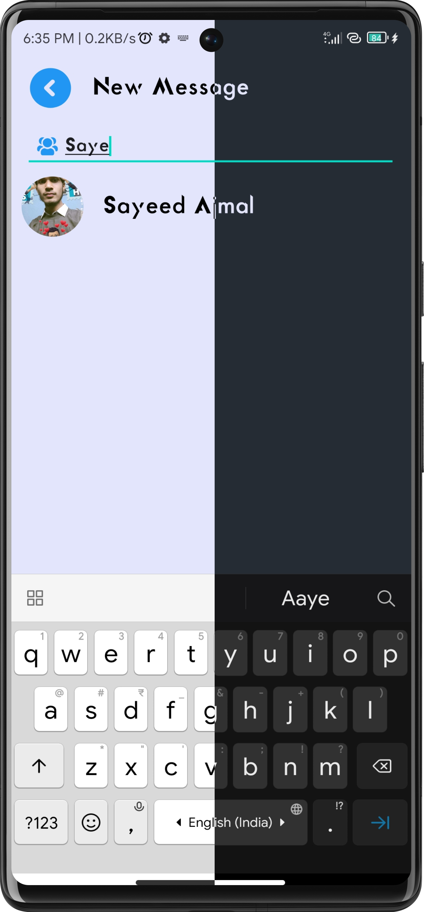

# ConnectX

ConnectX is a messaging application that aims to simplify communication while providing a seamless user experience. With features like real-time chat, calling, and status updates, ConnectX keeps you connected with your contacts effortlessly.

## Features

1. **Simple UI Interface:** Enjoy a clean and intuitive user interface designed for easy navigation and a pleasant user experience.

2. **Calling Feature (Developing Mode):** Stay connected with your contacts through voice calls, with calling functionality currently in development.

3. **Real-time Chatting Function:** Engage in real-time conversations with your contacts, ensuring instant communication.

4. **Status (Active):** Keep track of the online status of your contacts to know when they are available for communication.

5. **No Last Seen:** Respect privacy with no last seen feature, providing users with added control over their online presence.

6. **Dark Mode and Light Mode Available:** Seamlessly switch between dark and light modes to match your preference or phone settings.

7. **Chat Request (Developing Mode):** Send and receive chat requests to initiate conversations with new contacts, currently under development.

8. **No Message Seen:** Maintain privacy with no message seen feature, allowing users to read messages without notifying senders.

9. **Message Notification without UserName (Developing Mode):** Receive message notifications without revealing the sender's username, currently under development.

10. **Video Calling Feature (Developing Mode):** Experience face-to-face communication with video calling functionality currently in development.

## Technologies Used

1. **Firebase (Realtime Database):** Utilize Firebase for real-time data synchronization, enabling seamless communication between users.

2. **Glide (Image Fetch):** Employ Glide for efficient and smooth image loading, enhancing the user experience.

3. **CircleImageView (Round Image):** Implement CircleImageView to display profile images in a circular format, enhancing visual appeal.

4. **Neumorphism (Neumorphism View):** Leverage Neumorphism for a modern and elegant user interface design, providing a unique visual experience.

## Screenshots

## Getting Started

To get started with ConnectX, follow these steps:

1. Clone the repository: `git clone https://github.com/sayeedajmal/connectx.git`
2. Open the project in your preferred IDE.
3. Ensure you have the necessary dependencies installed.
4. Run the application on your device or emulator.

## Feedback and Contributions

We welcome any feedback or contributions to improve ConnectX. Feel free to submit bug reports, feature requests, or pull requests to help make ConnectX even better!
